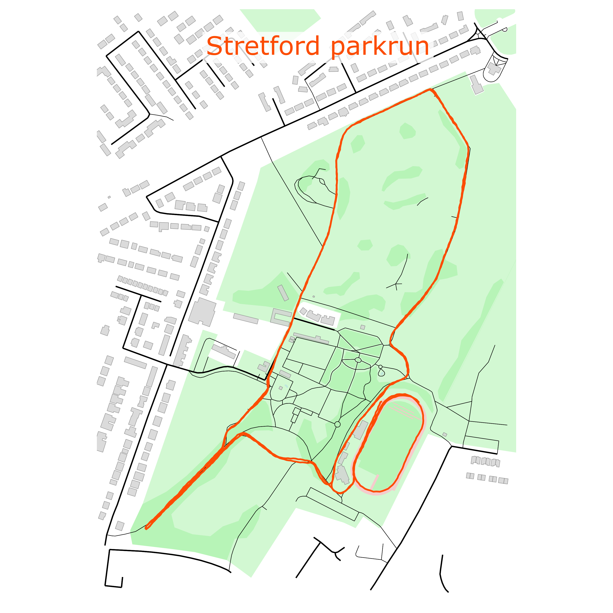

# GPX-Display

**GPX-Display** is a command-line tool for visualizing GPX files, such as those from a run or bike ride, enriched with street-level map data. It leverages the powerful [OSMnx](https://osmnx.readthedocs.io/en/stable/) Python library to fetch OpenStreetMap data for the surrounding area, creating detailed and visually appealing route plots.



---

## Features

- Plot GPX tracks with contextual map overlays  
- Highlight specific time or distance segments  
- Fetch OpenStreetMap data automatically using OSMnx  
- Customise plots via command-line options

---

## Installation

Ensure you have Python 3.7 or above. Install required dependencies via pip:

```bash
pip install -r requirements.txt
```

--- 

## Usage 

Run the tool localy from the command line with 
```bash
gpx-display -f Data/Stretford_parkrun.gpx --start-time 09:00:00 --end-distance 5
```

## Command Line Arguments
| Argument             | Description                                        |
| -------------------- | -------------------------------------------------- |
| `-f`, `--File`       | **(Required)** Path to the GPX input file          |
| `-s`, `--start-time` | Start time of the main activity (e.g., `09:00:00`) |
| `--start-distance`   | Start distance in kilometers (e.g., `1.34`)        |
| `-e`, `--end-time`   | End time of the main activity (e.g., `09:30:00`)   |
| `--end-distance`     | End distance in kilometers (e.g., `5.90`)          |
| `-t`, `--Test`       | Optional string to test argument parsing           |
| `-h`, `--help`       | Show help message and exit                         |

